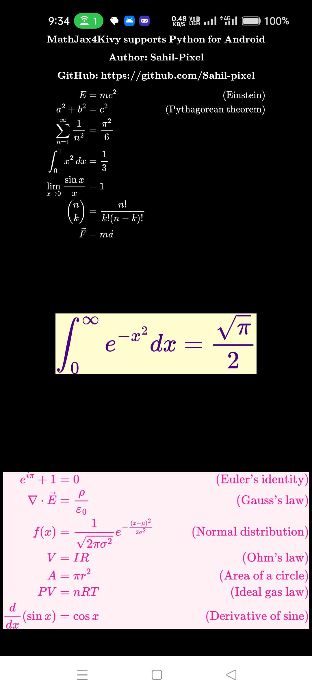

MathJax4Kivy
==========

Render beautiful LaTeX-style math equations in Kivy using MathJax on Android.

Module   : MathJax4Kivy
Author   : Sahil-Pixel
Date     : 31 July 2025
GitHub   : https://github.com/Sahil-pixel/MathJax4Kivy
MathJax  : https://www.mathjax.org/
Kivy     : https://kivy.org/

------------------------------------------------------------
Overview
------------------------------------------------------------

MathJaxImage is a Kivy widget that allows rendering LaTeX math expressions
on Android using MathJax via a Java WebView backend.

The widget displays the rendered equation as a Kivy Image texture
— fast, efficient, and in-memory (no file saving required).

------------------------------------------------------------
Features
------------------------------------------------------------

- Use MathJax to render LaTeX math on Android
- Supports dynamic font size, colors, and multiline equations
- Fully in-memory: renders to a Kivy texture
- Thread-safe rendering for smooth UI
- Native Kivy widget integration (Android only)

------------------------------------------------------------
Dependencies
------------------------------------------------------------

- Kivy
- Pyjnius
- Java classes:
    - MathJaxRenderer.java
    - BitmapUtil.java
- MathJax JS/CSS embedded in the WebView

------------------------------------------------------------
How to Use
------------------------------------------------------------
buildozer.spec 
---------
```
# Permissions required
android.permissions = INTERNET

# Java source code directory
android.add_src = ./java_code
```
KV Example:
-----------
```
MathJaxImage:
    latex: r"\[ x^2 + y^2 = z^2" \]
    font_size: "16px"
    text_color: "#000000"
    background_color: "#FFFFFF"
```
Python Example:
---------------
```
from mathjax4kivy import MathJaxImage

mjx = MathJaxImage(
    latex=r"\[ x^2 + y^2 = z^2" \],
    font_size="18px",
    text_color="#FF0000",
    background_color="#FFFFFF"
)
layout.add_widget(mjx)
```
Full Python Example:
--------------------

```python

# Author : Sahil-Pixel
# Date : 31 July 2025
# https://github.com/Sahil-pixel
# https://kivy.org/
# https://www.mathjax.org/
from kivy.app import App
from kivy.uix.boxlayout import BoxLayout
from kivy.utils import platform
from kivy.clock import Clock

if platform == 'android':
    from mathjax4kivy import MathJaxImage


class ExampleMathJax(BoxLayout):
    def __init__(self, **kwargs):
        super().__init__(orientation='vertical',padding=10,spacing=5, **kwargs)
        if platform == 'android':
            Clock.schedule_once(self.add_mathjax_widget, 0.2)  # 200ms delay

    def add_mathjax_widget(self, dt):

        tex1 = r'''
            \[ \textbf{MathJax4Kivy supports Python for Android} \]

            \[ \textbf{Author: Sahil-Pixel} \] 

            \[ \textbf{GitHub: https://github.com/Sahil-pixel} \]
            

            \[
            \begin{aligned}
                E &= mc^2 \quad & \text{(Einstein)} \\
                a^2 + b^2 &= c^2 \quad & \text{(Pythagorean theorem)} \\
                \sum_{n=1}^{\infty} \frac{1}{n^2} &= \frac{\pi^2}{6} \\
                \int_0^1 x^2 \, dx &= \frac{1}{3} \\
                \lim_{x \to 0} \frac{\sin x}{x} &= 1 \\
                \binom{n}{k} &= \frac{n!}{k!(n-k)!} \\
                \vec{F} &= m\vec{a}
            \end{aligned}
            \]
            '''


        mjx1 = MathJaxImage(
            latex=tex1,
            font_size="24px",
            text_color="#FFFFFF",
            background_color="#000000"
        )

        self.add_widget(mjx1)
        # For in line math
        #tex2 = r"\[ \int_0^\infty e^{-x^2} dx = \frac{\sqrt{\pi}}{2} \]"

        tex2 = r"$$ \int_0^\infty e^{-x^2} dx = \frac{\sqrt{\pi}}{2} $$"

        mjx2 = MathJaxImage(
            latex=tex2,
            font_size="24px",
            text_color="#4B0082",
            background_color="#FFFDD0"
        )
        self.add_widget(mjx2)

        tex3=r'''
        \begin{aligned}
            e^{i\pi} + 1 &= 0 \quad & \text{(Euler's identity)} \\
            \nabla \cdot \vec{E} &= \frac{\rho}{\varepsilon_0} \quad & \text{(Gauss's law)} \\
            f(x) &= \frac{1}{\sqrt{2\pi\sigma^2}} e^{-\frac{(x - \mu)^2}{2\sigma^2}} \quad & \text{(Normal distribution)} \\
            V &= IR \quad & \text{(Ohm's law)} \\
            A &= \pi r^2 \quad & \text{(Area of a circle)} \\
            PV &= nRT \quad & \text{(Ideal gas law)} \\
            \frac{d}{dx} \left( \sin x \right) &= \cos x \quad & \text{(Derivative of sine)}
        \end{aligned}
        '''

        mjx3 = MathJaxImage(
            latex=tex3,
            font_size="22px",
            text_color="#FF1493",
            background_color="#FFF0F5"
        )
        self.add_widget(mjx3)


class HelloMathApp(App):
    def build(self):
        return ExampleMathJax()


if __name__ == "__main__":
    HelloMathApp().run()

```
------------------------------------------------------------
Widget Properties
------------------------------------------------------------
```

- latex (str)            : MathJax expression string
- font_size (str)        : Font size in px (e.g., "16px")
- text_color (str)       : Foreground hex color (e.g., "#000000")
- background_color (str) : Background hex color (e.g., "#FFFFFF")
```
------------------------------------------------------------
Rendering Pipeline
------------------------------------------------------------

1. Python sets or updates widget properties
2. Java MathJaxRenderer renders HTML+MathJax inside a WebView
3. BitmapUtil extracts pixels into a byte array
4. A background Python thread receives raw RGBA data
5. Kivy Texture is built and updated
6. Widget displays the math expression

------------------------------------------------------------
Resource Cleanup
------------------------------------------------------------

To manually clean resources:
    mathjax.release()

Or rely on Python’s automatic garbage collection (__del__()).

------------------------------------------------------------
Java Setup (for Android)
------------------------------------------------------------

Required Java classes:

- MathJaxRenderer.java
    - Loads HTML with MathJax script into a WebView and renders bitmap
- BitmapUtil.java
    - Extracts the rendered bitmap as RGBA array

Ensure that MathJax JavaScript and CSS are bundled with the app and loaded in the WebView.

------------------------------------------------------------
Repo Structure
------------------------------------------------------------
```
/MathJax4Kivy/
├── main.py                        # Main Kivy demo using MathJaxImage
├── mathjax4kivy.py               # Defines MathJaxImage widget
├── backend/
│   └── mathjax_render.py         # Pyjnius bridge to Java backend
└── java/
    └── org/mathjax/
        ├── MathJaxRenderer.java  # Java rendering backend using WebView
        └── BitmapUtil.java       # Converts Android Bitmap to RGBA byte[]
```
------------------------------------------------------------
## 📷 Screenshot
Here's what the app looks like on Android:
<p align="center">
  
</p>


------------------------------------------------------------
## Pay for Support

If you find this project helpful and want to support development, you can donate for support:

-  [](https://ko-fi.com/sahilpixel)
  
- [](https://paypal.me/SKSAHILIN?country.x=IN&locale.x=en_GB)


Thank you for your support!
---

------------------------------------------------------------
License
------------------------------------------------------------

MIT License  
Created by Sahil-Pixel  
Free to use in personal and commercial Android+Kivy projects.
